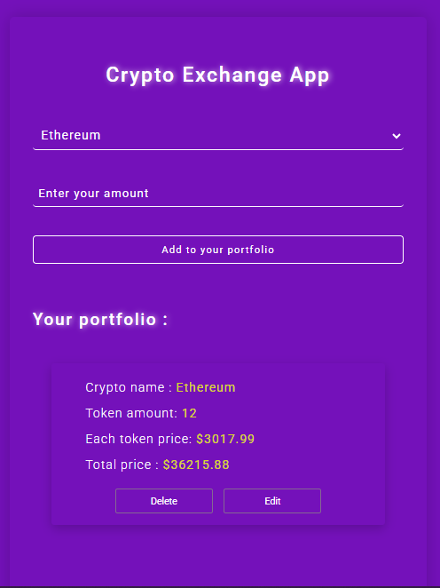

## Crypto Exchange App 💱💲

A modern and beginner-friendly Crypto Portfolio Manager built with HTML, CSS, and Vanilla JavaScript.
This app allows users to select a cryptocurrency, enter the token amount, calculate the cost, and manage a personal portfolio with Edit and Delete actions.

## Preview 📸

## [Live Demo](https://01mehran.github.io/Crypto-Exchange-App/)

### Features ⭐

- 🎯 Crypto Selection — Choose a cryptocurrency from the dropdown

- 🔢 Token Amount Input — Enter how many tokens you want

- ➕ Add to Portfolio — Adds a card with full data

- ✏️ Editable Items — Change the token amount anytime

- ❌ Delete Support — Remove any item easily

- 💰 Auto Price Calculation

- 🎨 Clean and Modern UI with glowing - purple theme
- 💻 Fully responsive UI

- Fetches live crypto prices using CoinGecko API

### Technologies Used 🛠️

1. HTML5

2. CSS3

3. Vanilla JavaScript

4. CoinGecko Public API

## Contact 
📧 **Email :** [mehranmohamadi1311@gmail.com](mailto:your-email@example.com)

#### If you like this project, give it a ⭐ on GitHub! 💛